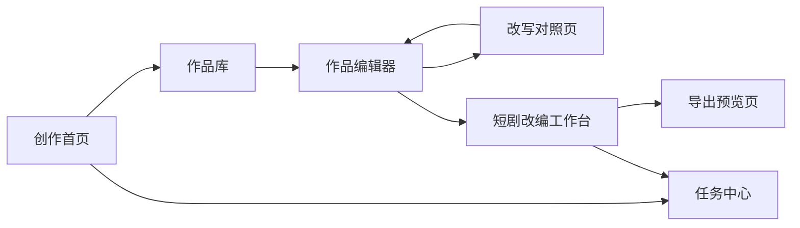

# 墨枢 InkAxis 小说转短剧脚本设计方案

版本：V1.0  
日期：2026-06-20  
交付类型：Markdown 交互与功能设计方案  
默认脚本类型：短剧分场稿

## 1. 设计目标

本设计方案面向“写小说 -> 改小说 -> 小说转短剧分场稿”的产品闭环，重点描述创作中心、作品编辑器、改写对照页、短剧改编工作台和导出预览页的页面结构与交互规则。`小说skill/` 的全部能力已经登记到《小说skill能力迁移清单.md》，本方案只保留正式产品页面和功能映射，不依赖原目录运行。

设计目标：

- 让小说作者能在同一工作台内完成写作、改稿和改编。
- 让短剧编剧能快速从小说文本生成分集大纲和分场稿。
- 让 AI 输出保持可编辑、可检查、可回退、可导出。
- 将 `小说skill/` 的写作、改写、拆文、审查经验转化为产品规则和 AI 工作流。

## 2. 设计原则

### 2.1 创作优先

页面应服务于“继续写”和“继续改”，避免让用户在复杂配置里迷路。所有 AI 操作都围绕当前作品、当前章节、当前场次展开。

### 2.2 人工确认优先

AI 生成不能直接覆盖正文。写小说生成草稿，改小说进入对照确认，转短剧生成可编辑草稿。

### 2.3 短剧表达优先

脚本不是把小说分段复制成对白，而是把心理、叙述和背景说明转化为画面、动作、冲突和口语化对白。

### 2.4 长任务可感知

小说改写和短剧生成可能持续较久，必须展示进度、当前步骤、预计剩余时间、失败原因和重试入口。

## 3. 页面总览

```text
创作中心
├─ 创作首页
├─ 作品库
├─ 作品编辑器
├─ 改写对照页
├─ 短剧改编工作台
├─ 导出预览页
└─ 任务中心
```

页面关系：



## 4. 创作首页

### 4.1 页面目标

帮助用户快速回到最近的写作、改写或短剧改编任务。

### 4.2 页面结构

```text
顶部：创作中心标题 + 新建作品 + 导入作品
主体左侧：最近作品
主体中间：进行中的任务
主体右侧：快捷入口
底部：最近导出、质量报告、Token 使用摘要
```

### 4.3 核心组件

最近作品卡片：

- 作品名。
- 类型。
- 当前状态。
- 最近编辑时间。
- 章节数/集数/场次数。
- 主按钮：继续写作、继续改编、查看脚本。

进行中的任务：

- 任务名称。
- 当前步骤。
- 进度条。
- 状态：排队中、生成中、待确认、失败、已完成。
- 操作：查看、取消、重试。

快捷入口：

- 新建长篇。
- 新建短篇。
- 导入小说。
- 转短剧。
- 改写文本。

## 5. 作品库

### 5.1 页面目标

统一管理小说项目、改编项目和脚本草稿。

### 5.2 页面布局

```text
左侧筛选：类型、状态、更新时间、标签
中间列表：项目卡片/表格
右侧详情：选中项目的章节、脚本、任务、导出记录
```

### 5.3 筛选项

- 全部。
- 小说项目。
- 改编项目。
- 短剧脚本。
- 写作中。
- 改写中。
- 改编中。
- 已导出。

### 5.4 项目操作

- 打开。
- 重命名。
- 复制。
- 导出。
- 归档。
- 删除。

删除需要二次确认；归档不删除数据。

## 6. 作品编辑器

### 6.1 页面目标

承载小说写作和小说改写的基础编辑体验。

### 6.2 桌面端布局

```text
左栏：作品树
中栏：正文编辑器
右栏：AI 助手
底栏：字数、保存状态、版本、Token 预估
```

左栏内容：

- 设定。
- 人物。
- 大纲。
- 章节。
- 改写任务。
- 短剧草稿。

中栏内容：

- 章节标题。
- 正文编辑区。
- 段落选区工具条。
- 章节备注。

右栏内容：

- 续写。
- 扩写。
- 缩写。
- 改风格。
- 去 AI 味。
- 强化冲突。
- 对白优化。
- 查一致性。
- 转短剧。

### 6.3 段落选区工具条

用户选中文本后展示：

- 改写。
- 润色。
- 去 AI 味。
- 口语化。
- 转为对白。
- 加强爽点。
- 发送到短剧改编。

### 6.4 保存与版本

规则：

- 自动保存用户编辑。
- AI 生成内容先进入草稿或建议态。
- 接受改写后创建新版本。
- 支持查看版本差异和回退。

## 7. 改写对照页

### 7.1 页面目标

让用户清楚比较原文、AI 改写和修改原因，逐段确认，避免误覆盖。

### 7.2 页面布局

```text
顶部：任务信息 + 改写模式 + 接受全部 + 放弃任务
左栏：原文
中栏：AI 改写稿
右栏：修改说明和操作
底部：上一段/下一段 + 保存为新版本
```

### 7.3 段落状态

- 未处理。
- 已接受。
- 已拒绝。
- 已重写。
- 需人工确认。

### 7.4 用户动作

- 接受本段。
- 拒绝本段。
- 再改一次。
- 输入要求再改。
- 查看差异。
- 标记问题。
- 保存为新版本。

### 7.5 改写模式配置

配置面板字段：

- 改写范围：片段、章节、整卷。
- 改写模式：基础润色、去 AI 味、爽点增强、节奏压缩、情绪强化、对白口语化、题材迁移。
- 保留项：人物关系、关键剧情、叙事视角、结局。
- 强化项：冲突、反转、打脸、悬念、情绪、对白。
- 禁止项：改变主角、改变结局、增加新世界观。

## 8. 短剧改编工作台

### 8.1 页面目标

将小说内容转为可编辑的短剧分集大纲和分场稿。

### 8.2 桌面端布局

```text
顶部：项目名 + 当前草稿 + 质量分 + 导出
左栏：章节源文/作品树
中左栏：分集目录
中栏：分场稿编辑器
右栏：AI 助手/质量检查/角色设定
```

布局说明：

- 左栏用于查看原小说章节或导入文本。
- 中左栏用于管理集数和场次。
- 中栏是主编辑区，显示当前集和当前场。
- 右栏提供 AI 续写、重写、质检、格式修复和人物提示。

### 8.3 移动端策略

移动端只支持：

- 查看分集。
- 查看场次。
- 添加批注。
- 轻量修改文本。
- 查看导出记录。

移动端不支持完整短剧改编工作台，并展示提示：

```text
短剧改编需要较大屏幕，请在电脑上使用。
```

## 9. 转短剧启动流程

### 9.1 入口

入口位置：

- 作品编辑器右侧 AI 助手中的“转短剧”。
- 作品库项目卡片中的“转短剧”。
- 创作首页快捷入口中的“导入小说转短剧”。

### 9.2 步骤一：选择内容

可选范围：

- 当前章节。
- 多个章节。
- 整部作品。
- 粘贴文本。
- 上传 DOCX。
- 选择已有改编方案。

输入校验：

- 文本不能为空。
- DOCX 解析失败时展示失败原因。
- 超长文本提示分批改编。
- 已有短剧草稿时提示继续或新建。

### 9.3 步骤二：选择改编目标

字段：

- 目标集数。
- 单集时长。
- 目标风格。
- 受众偏好。
- 保留剧情。
- 必删剧情。
- 强化方向。

默认值：

- 目标集数：20 集。
- 单集时长：1 到 3 分钟。
- 输出格式：短剧分场稿。
- 强化方向：强开场、强冲突、强钩子、对白口语化。

### 9.4 步骤三：生成改编方案

AI 输出：

- 故事核。
- 主角欲望。
- 核心冲突。
- 主要人物关系。
- 情节取舍。
- 题材迁移建议。
- 短剧化风险。

用户动作：

- 确认方案。
- 修改要求。
- 重新生成。
- 返回选择内容。

### 9.5 步骤四：生成分集大纲

每集输出：

- 集数。
- 标题。
- 预计时长。
- 本集目标。
- 核心冲突。
- 爽点。
- 结尾钩子。

用户动作：

- 调整集数。
- 合并集。
- 拆分集。
- 重写某集。
- 锁定某集不再改动。

### 9.6 步骤五：生成分场稿

每场输出：

- 场景。
- 人物。
- 本场功能。
- 预计时长。
- 画面。
- 旁白。
- 对白。
- 表演/镜头。
- 钩子。

用户动作：

- 新增场次。
- 删除场次。
- 调整顺序。
- 重写本场。
- 对白口语化。
- 心理外化。
- 补钩子。
- 质检本场。

## 10. 短剧分场稿格式

默认模板：

```text
第N集
预计时长：
核心爽点：
本集冲突：
结尾钩子：

【第N场】
场景：内/外｜地点｜日/夜
人物：
本场功能：
预计时长：

画面：
旁白：
对白：
表演/镜头：
钩子：
```

格式规则：

- 每集必须有预计时长、核心爽点、本集冲突、结尾钩子。
- 每场必须有场景、人物、本场功能和预计时长。
- 对白需要标明角色名。
- 画面必须可拍摄，不能只写抽象心理。
- 旁白不能连续承担主要剧情推进。
- 钩子必须是悬念、反转、冲突升级或情绪断点。

对白建议格式：

```text
角色A：你不是说不会回来吗？
角色B：我回来，不是为了你。
```

表演/镜头建议格式：

```text
表演/镜头：角色A手指停在门把上，听见这句话后缓缓回头。
```

## 11. AI 工作流

### 11.1 小说写作工作流

```text
输入创意
-> 题材和受众识别
-> 商业卖点提取
-> 设定生成
-> 人物生成
-> 大纲生成
-> 章节生成
-> 审查
-> 保存草稿
```

关键输出：

- 故事定位。
- 人物表。
- 世界观/背景。
- 主线/支线。
- 章节大纲。
- 正文草稿。
- 审查报告。

### 11.2 小说改写工作流

```text
选择文本
-> 识别问题
-> 确定改写模式
-> 分段改写
-> 生成修改说明
-> 自检
-> 三栏对照
-> 用户确认
```

问题识别维度：

- 表达重复。
- AI 味。
- 节奏拖沓。
- 爽点不足。
- 情绪不足。
- 对白不自然。
- 人设不一致。
- 剧情逻辑断裂。

### 11.3 小说转短剧工作流

```text
输入小说
-> 章节摘要
-> 故事核提取
-> 人物关系提取
-> 情节节点提取
-> 改编策略
-> 分集大纲
-> 分场稿
-> 质量检查
-> 格式修复
-> 导出
```

阶段说明：

- 章节摘要：压缩长文本，避免上下文超限。
- 故事核提取：明确主角、欲望、阻碍、代价和结局。
- 人物关系提取：为短剧冲突和对白生成提供约束。
- 情节节点提取：识别必须保留、可以合并、可以删除的节点。
- 改编策略：确定开场钩子、节奏压缩、心理外化方式。
- 分集大纲：先确定每集目标，再生成具体场次。
- 分场稿：生成可拍画面、对白和钩子。
- 质量检查：标记格式问题和短剧化问题。

## 12. 质量检查设计

### 12.1 总分模型

满分 100 分：

- 格式完整度：15 分。
- 前 3 秒钩子：15 分。
- 冲突密度：15 分。
- 结尾钩子：15 分。
- 对白口语化：10 分。
- 小说残留控制：10 分。
- 心理活动外化：10 分。
- 可拍性：10 分。

### 12.2 检查项

格式检查：

- 是否缺少集标题。
- 是否缺少场次。
- 是否缺少场景、人物、本场功能。
- 是否缺少结尾钩子。

节奏检查：

- 前 3 秒是否有钩子。
- 每 30 到 60 秒是否有冲突推进。
- 是否存在连续说明段。
- 是否存在低信息密度场次。

短剧化检查：

- 是否有大段内心独白。
- 是否有无法拍摄的抽象描写。
- 是否旁白过多。
- 是否对白过于书面。
- 是否缺少情绪爆发点。

人物检查：

- 人物动机是否清楚。
- 角色关系是否前后一致。
- 角色说话方式是否稳定。
- 关键人物是否突然消失。

### 12.3 质量报告格式

```text
总评分：
结论：

主要问题：
1.
2.
3.

逐集问题：
第1集：
第2集：

逐场问题：
【第1场】：
【第2场】：

可自动修复：
1.
2.

需要人工判断：
1.
2.
```

## 13. AI 助手操作

### 13.1 作品编辑器内

按钮：

- 续写。
- 扩写。
- 缩写。
- 润色。
- 去 AI 味。
- 强化爽点。
- 对白优化。
- 审查本章。
- 转短剧。

### 13.2 改写对照页内

按钮：

- 接受本段。
- 拒绝本段。
- 再改一次。
- 指定要求再改。
- 解释修改。
- 标记问题。
- 保存为新版本。

### 13.3 短剧改编工作台内

按钮：

- 重写本集。
- 重写本场。
- 补开场钩子。
- 补结尾钩子。
- 对白口语化。
- 心理外化。
- 压缩旁白。
- 增强冲突。
- 质检本集。
- 质检全稿。

## 14. 导出预览页

### 14.1 页面目标

让用户在导出前确认格式、范围和质量问题。

### 14.2 页面结构

```text
左侧：导出设置
中间：脚本预览
右侧：格式检查和质量问题
底部：导出按钮
```

### 14.3 导出设置

- 导出范围：全部、选中集、选中场。
- 导出格式：Markdown、DOCX。
- 是否包含质量报告。
- 是否包含改编方案。
- 是否包含人物表。
- 是否包含场次目录。

### 14.4 导出前检查

导出前必须提示：

- 缺失字段。
- 无结尾钩子的集。
- 无人物的场。
- 旁白过多的场。
- 对白为空的场。
- 质量评分低于阈值的集。

允许用户：

- 继续导出。
- 返回修复。
- AI 自动修复可修复项。

## 15. 异常与空状态

### 15.1 文本为空

提示：

```text
请先输入小说正文、选择章节，或上传 DOCX 文件。
```

### 15.2 DOCX 解析失败

提示：

```text
文档解析失败。请检查文件是否损坏，或复制正文后重新导入。
```

### 15.3 文本过长

提示：

```text
当前内容较长，建议按章节分批改编。系统会先生成章节摘要，再继续生成短剧脚本。
```

### 15.4 AI 生成失败

提示：

```text
生成中断，已保留当前进度。你可以重试、调整范围，或从已完成步骤继续。
```

### 15.5 Token 不足

提示：

```text
本次任务预计消耗较多 Token，当前额度不足。请缩小生成范围或补充额度。
```

### 15.6 用户取消任务

提示：

```text
任务已取消，已生成内容会保留为草稿。
```

## 16. 样例文档验证

### 16.1 `改编-上岸 (1).docx`

验证目标：

- 能识别原始小说文本和改编说明。
- 能识别现代到古代科举的题材迁移。
- 能输出人物映射和情节取舍。
- 能基于改编方案继续生成短剧分集大纲。

预期结果：

- 输出一份“改编策略报告”。
- 生成分集大纲。
- 生成至少一集短剧分场稿。
- 标记仍需人工确认的设定变更。

### 16.2 `剧本 (1).docx`

验证目标：

- 能识别其为短剧分场稿初稿，而非传统影视剧本。
- 能解析场次、对白、动作、旁白。
- 能补齐集数、预计时长、核心爽点和结尾钩子。
- 能输出格式与质量检查报告。

预期结果：

- 给出“可作为短剧分场稿初稿”的判断。
- 标记格式缺失项。
- 标记小说残留和旁白过多问题。
- 生成标准化短剧分场稿版本。

## 17. 前后端实现建议

### 17.1 前端路由

建议新增：

- `/creation`：创作首页。
- `/creation/projects`：作品库。
- `/creation/projects/:id/editor`：作品编辑器。
- `/creation/rewrite/:taskId`：改写对照页。
- `/creation/scripts/:draftId`：短剧改编工作台。
- `/creation/scripts/:draftId/export`：导出预览页。

### 17.2 前端状态

建议新增 Pinia Store：

- `creationStore`：作品、章节、当前编辑状态。
- `rewriteStore`：改写任务、段落状态、确认结果。
- `scriptStore`：脚本草稿、分集、场次、质量报告。
- `generationTaskStore`：长任务进度、SSE 状态、失败重试。

### 17.3 后端服务

建议新增：

- `StoryProjectService`
- `StoryChapterService`
- `StoryRewriteService`
- `ScriptConversionService`
- `ScriptQualityService`
- `StoryExportService`
- `GenerationTaskService`

### 17.4 复用现有能力

可复用：

- 现有 LLM 模型配置。
- 现有流式输出能力。
- 现有 RAG 知识库能力。
- 现有 Token 使用统计。
- 现有审计日志。
- 现有用户与组织权限。

需要新增：

- 创作域数据表。
- DOCX 导入到故事文本的解析流程。
- 短剧结构化输出与格式修复。
- 改写任务的段落级确认。
- 脚本导出能力。

## 18. 验收用例

### 18.1 写小说

用例：

1. 用户新建短篇项目。
2. 输入题材、主角、核心冲突。
3. AI 生成故事核、大纲和第一章。
4. 用户编辑正文并保存。
5. 用户执行章节审查。

通过标准：

- 作品创建成功。
- 正文可编辑。
- AI 结果不覆盖用户输入。
- 审查报告包含具体问题和修改建议。

### 18.2 改小说

用例：

1. 用户选择一章正文。
2. 选择“去 AI 味 + 爽点增强”。
3. AI 生成改写结果。
4. 用户逐段接受或拒绝。
5. 保存为新版本。

通过标准：

- 原文、改写稿、修改说明三栏展示。
- 段落状态清晰。
- 保存后生成新版本。
- 可回退到旧版本。

### 18.3 小说转短剧

用例：

1. 用户选择多个章节。
2. 设置目标 20 集、单集 1 到 3 分钟。
3. AI 生成改编方案。
4. 用户确认后生成分集大纲。
5. 用户生成第 1 集分场稿。
6. 用户执行质量检查并导出 Markdown。

通过标准：

- 改编方案包含故事核、人物关系、情节取舍。
- 分集大纲包含核心冲突和结尾钩子。
- 分场稿符合标准模板。
- 质量报告指出具体问题。
- 导出文件结构完整。

### 18.4 DOCX 样例

用例：

1. 导入 `改编-上岸 (1).docx`。
2. 系统识别改编关系。
3. 生成短剧改编方案。

通过标准：

- 能识别题材迁移。
- 能输出人物映射。
- 能输出情节取舍。

用例：

1. 导入 `剧本 (1).docx`。
2. 系统识别短剧分场稿初稿。
3. 系统补齐格式并质检。

通过标准：

- 能识别已有场次与对白。
- 能补齐缺失字段。
- 能标记非标准剧本问题。

## 19. 后续迭代

V1.5：

- 分集节奏图。
- 冲突密度可视化。
- 人物出场统计。
- 批量改写。
- 批量质检。
- 长篇拆文库。
- 短篇拆文库。
- 多视角对抗式审查。
- 对标资料引用。
- 文风提取。

V2：

- 多人协作批注。
- 审稿流程。
- 角色对白风格库。
- 平台模板。
- 投稿格式包。
- 长篇扫榜。
- 短篇扫榜。
- 浏览器 CDP 采集。
- 封面生成。
- 项目模板中心。
- AI 角色配置中心。
- 规则中心。

V3：

- 扫榜趋势接入。
- 封面生成。
- 素材库。
- 分镜稿导出。
- 生产排期管理。

## 20. `小说skill` 页面映射补充

删除 `小说skill/` 目录后，产品页面需要承接其全部能力。页面映射如下：

| 原能力 | 产品页面 | 主要交互 |
|---|---|---|
| `story` 主入口 | 创作首页 AI 意图入口 | 输入自然语言，系统推荐写作、改写、拆文、扫榜、封面、转短剧等入口 |
| `story-long-write` | 长篇创作工作台 | 开书、设定、人物、卷纲、章纲、续写、回炉、伏笔追踪 |
| `story-short-write` | 短篇创作工作台 | 情绪目标、反转结构、小节大纲、短篇正文、爆点质检 |
| `story-import` | 导入作品页 | TXT/Markdown/DOCX 导入、章节切分、篇幅识别、残稿检测、反向生成项目 |
| `story-deslop` | 改写对照页 | AI 味扫描、问题标注、去味改写、白名单保护、差异确认 |
| `story-review` | 审查中心 | full/lean/solo 审查、平台 rubric、S1-S4 问题、修复建议 |
| `story-long-analyze` | 长篇拆文库 | 黄金三章、全量拆文、角色/剧情/设定、文风、对标引用 |
| `story-short-analyze` | 短篇拆文库 | 故事核、情绪曲线、爆点、反转、写作手法、共鸣层 |
| `story-long-scan` | 长篇市场洞察 | 榜单采集、趋势分析、平台对比、选题决策 |
| `story-short-scan` | 短篇市场洞察 | 情绪热度、题材风口、传播点、复扫提醒 |
| `story-cover` | 封面生成器 | 书名、作者、平台、题材、参考图、多版本封面 |
| `story-setup` | 项目模板与规则中心 | 模板、AI 角色、规则、自动检查配置 |
| `browser-cdp` | 采集连接器 | 浏览器状态检测、登录态授权、榜单采集、Token 提取 |

新增设计入口：

- `创作首页` 增加“市场洞察”“拆文库”“封面生成”“审查中心”快捷入口。
- `作品库` 增加“对标资料”“拆文报告”“封面资产”关联标签。
- `作品编辑器` 的 AI 助手增加“查资料”“查设定”“审查本章”“引用对标”。
- `短剧改编工作台` 可读取拆文库的人物、情节节点、文风和对标手法，提升改编稳定性。
- `任务中心` 承接扫榜、拆文、封面、审查、导出等长任务。
